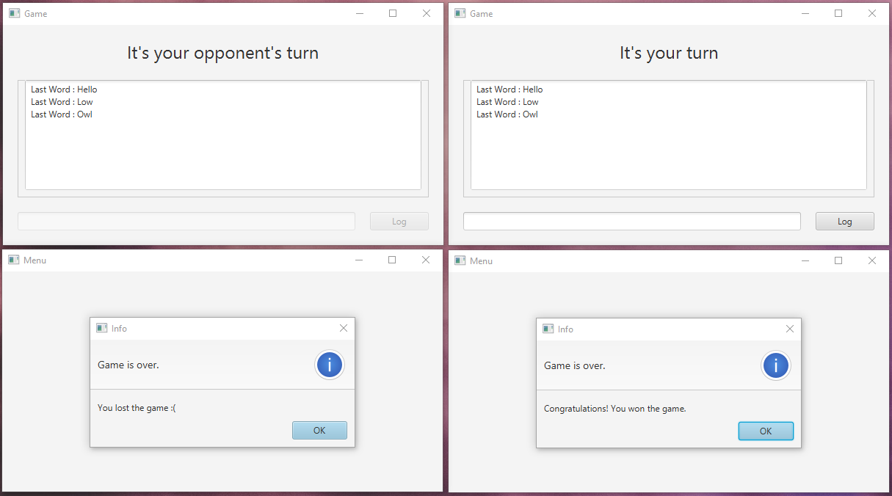

# last*2*letters

A two player word game that supports both UDP and TCP transport protocols.


### Running

* Create executables for both client side and server side of the project by running below command.
```
mvn package
```
* l2l.jar under target is client side executable file.
* l2l_server.jar under target is server side executable file.

Instructions :

1- Start the server. 

2- Start two or more clients.

3- Enter server-compatible connection information for clients.

4- Create connections.

5- Play the game.

### Supports 2+ players



## License

This project is licensed under the MIT License - see the [LICENSE.md](LICENSE.md) file for details